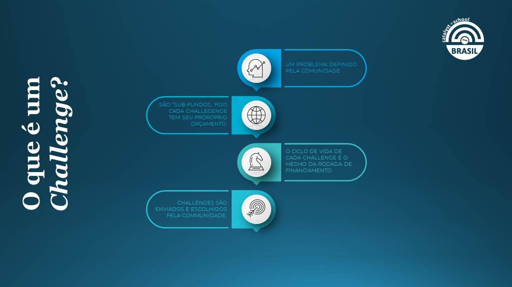

# Anúncio - Fund 10 -



[Inscreva-se no TownHall da IOG aqui](https://bit.ly/3rCicSR)

Resumo: Neste vídeo, discutimos o lançamento do Fundo 10 da IOG no dia 21 de junho e fornecemos informações sobre o Project Catalyst. Explicamos que o objetivo do Fundo 10 é reunir indivíduos motivados e capacitados para contribuir com o ecossistema e a comunidade do Cardano. \
O Project Catalyst é um projeto que reúne pessoas apaixonadas por resolver problemas específicos e trabalhar juntas para explorar o potencial da colaboração humana. Ele segue um processo de financiamento e governança contínua, com a comunidade decidindo quem receberá os fundos a serem distribuídos. \
A governança do Catalyst é diferente das organizações tradicionais, pois permite que a comunidade tenha poder de decisão sobre a distribuição dos fundos. Também destacamos a importância da colaboração e do desenvolvimento de ferramentas para fortalecer a participação dos membros da comunidade. \
Além disso, mencionamos que o Catalyst busca aprimorar a economia baseada em blockchain, a governança, a comunidade e o impacto social. \
Por fim, informamos sobre o anúncio do Fundo 10 no Town Hall da IOG e convidamos os espectadores a participarem da comunidade do Cardano.\

<figure><figcaption></figcaption></figure>

<figure><figcaption></figcaption></figure>

<figure><figcaption></figcaption></figure>

<figure><figcaption></figcaption></figure>

<figure><figcaption></figcaption></figure>

<figure><figcaption></figcaption></figure>

<figure><figcaption></figcaption></figure>

<figure><figcaption></figcaption></figure>
