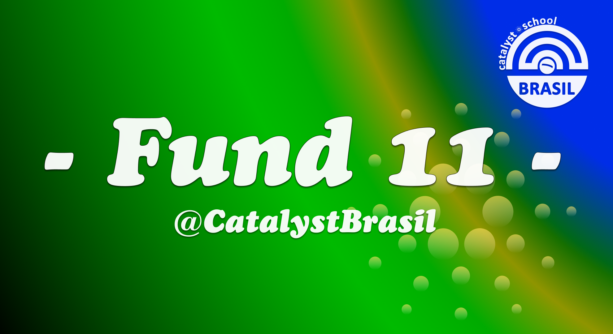
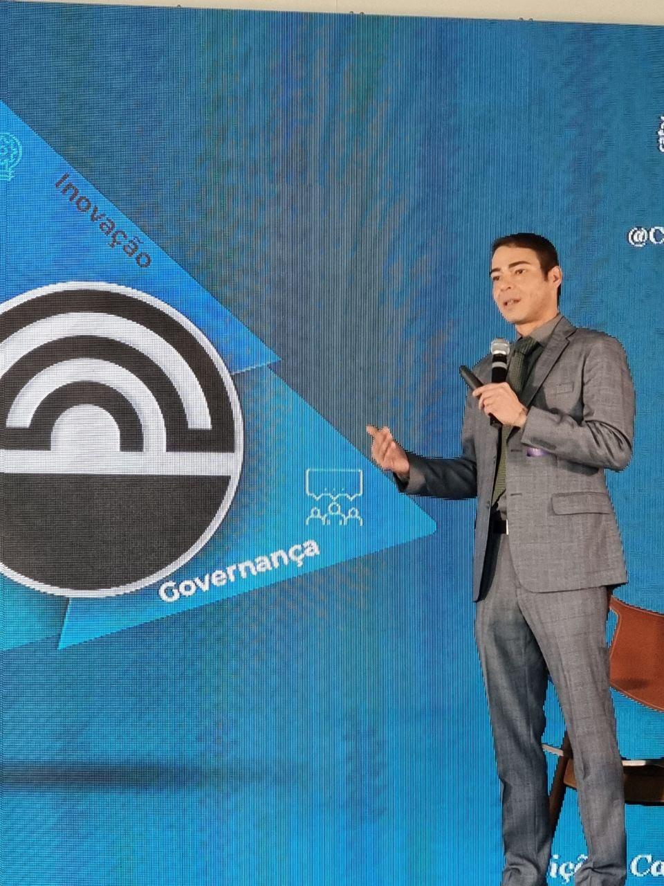

# Catalyst Brasil: Impulsionando a inovação na Comunidade Cardano

Desafio: [f10-desenvolvimento-e-infraestrutura.md](../apresentacoes/categorias-do-fund-10/f10-desenvolvimento-e-infraestrutura.md "mention")

<figure><figcaption></figcaption></figure>


Proposta no Ideascale (em inglês): [https://cardano.ideascale.com/c/idea/107094](https://cardano.ideascale.com/c/idea/107094)


### Nosso objetivo é resolver a falta de infraestrutura da comunidade Cardano no Brasil, fornecendo educação confiável por meio de documentação de qualidade, vídeos bem produzidos e realização de eventos presenciais e online envolventes.

### \[GERAL] Subsídios solicitados em $ADA:

62250

### \[GERAL] Por favor, especifique quantos meses você espera que seu projeto dure (de 2 a 12 meses)

8

### \[GERAL] Por favor, indique se a sua proposta foi traduzida automaticamente para o inglês a partir de outro idioma.

Não

### \[GERAL] Qual é o problema que você quer resolver? (limite de 200 caracteres, incluindo espaços)

Vamos estabelecer a infraestrutura para a comunidade Cardano no Brasil a fim de promover a colaboração, a criação de redes e o crescimento dentro do ecossistema Cardano.

### \[GERAL] Site/repositório GitHub, ou qualquer outro link relevante

Link\
[https://catalystbrasil.gitbook.io](https://catalystbrasil.gitbook.io/)\
Link 2\
[https://www.youtube.com/@catalystbrasil](https://www.youtube.com/@catalystbrasil)\
Link 3\
[https://linktr.ee/catalystbrasil](https://linktr.ee/catalystbrasil)

### \[GERAL] Seu projeto tem alguma dependência de outras organizações, técnicas ou não?

Não

### \[GERAL] Se SIM, descreva qual é a dependência e por que você acredita que ela é essencial para a entrega do seu projeto. Se NÃO, escreva "Sem dependências." neste campo.

Sem dependência.

### \[GERAL] Os resultados do seu projeto serão totalmente Open Source?

sim.

### \[GERAL] Se NÃO, descreva quais saídas não serão de código aberto. Se SIM, escreva "O projeto será totalmente open source." neste campo.

Projeto totalmente open source

### \[GERAL] Categoria da Proposta

Eventos

### \[IMPACTO] Descreva a solução proposta.

Ao envolver ativamente a comunidade em nossas iniciativas, nosso objetivo é promover um senso de propriedade, colaboração e compartilhamento de conhecimento. Nossa abordagem prioriza a inclusão, acessibilidade e o uso de vários canais, tanto digitais como presenciais, para envolver uma ampla gama de membros da comunidade.

Central para nossa estratégia está a crença de que uma comunidade forte pode impulsionar a inovação, contribuir com insights valiosos e atrair novos desenvolvedores e hodlers para o ecossistema Cardano. Através de nossas iniciativas, buscamos capacitar os membros da comunidade, cultivar suas habilidades e fornecer plataformas para que eles possam mostrar suas contribuições.

O impacto de nossa solução será demonstrado através de métricas tangíveis e feedback qualitativo. Mediremos a participação da comunidade, o engajamento nas redes sociais, a participação em workshops e o crescimento de projetos colaborativos dentro do ecossistema Cardano. Além disso, buscaremos ativamente o feedback da comunidade para avaliar a eficácia e relevância de nossas iniciativas. Ao analisar esses indicadores, podemos melhorar continuamente nossos programas, adaptar-nos às necessidades da comunidade e mostrar o impacto positivo que a comunidade brasileira está causando no ecossistema Cardano.

\

**Why São Paulo?**

\

## Índice de Cidade Empreendedora

> São Paulo lidera o ranking geral das melhores cidades para empreender no Brasil. A capital é o maior centro financeiro do país, e se destaca nos índices de Infraestrutura - em especial nas áreas do transporte interurbano e condições urbanas mais adequadas e favoráveis ao desenvolvimento de negócios - e Acesso a Capital, sendo a campeã no capital de risco recebido em relação ao PIB. Em 2022, o tempo médio para se abrir uma empresa em São Paulo foi de 1 dia e 5 horas, com uma média de aproximadamente 9.865 atendimentos por mês para abertura de empresas.

\

## Ecossistema de startups

> Entre 2021 e 2022 São Paulo avançou 3 posições no ranking global de ecossistemas de startups, ocupando agora a 28ª colocação. É a única cidade da América Latina no Top 30. SP vem se destacando no empreendedorismo tecnológico, especialmente com as Fintechs e Proptechs. Abriga 12 dos 22 unicórnios brasileiros. Concentra um total de US$ 13 bilhões em fundos de venture capital, quase o triplo da média global. O acesso a políticas públicas de apoio às startups e a programas de financiamento são fatores que incentivam a localização na cidade.

\

## Instituições universitárias

> São Paulo é a cidade com mais instituições de ensino superior no Brasil, possuindo 166 instituições, quantidade acima da apresentada em 24 dos estados brasileiros. Em 2021, as instituições da cidade atenderam mais de 893 mil estudantes, contando com 34.331 docentes em exercício. Aproximadamente 28% das instituições de ensino superior de São Paulo têm nota igual ou superior a 4 no Conceito Preliminar de Curso (CPC).

\

## Concluintes no Ensino Superior

> Mais de 142 mil estudantes do ensino superior se apresentam ao mercado de trabalho por ano em São Paulo. A área de “Negócios, administração e direito” é a que mais apresenta novos graduados. Em 2021, foram 52 mil concluintes, 37% do total. “Saúde e bem-estar” e “Educação” também são bastante representativas.

\

## Polo da economia criativa

> A economia criativa tem papel crescente na geração de valor e de empregos. A cidade de São Paulo tem grande relevância no cenário nacional concentrando 15,7% dos empregos formais do setor no Brasil. A remuneração média também é um diferencial da cidade, 73% superior à nacional.

\

## Polo industrial

> São Paulo é um espaço econômico que abriga praticamente todas as divisões de atividades listadas na Classificação Nacional da Atividade Econômica (CNAE), de confecção de artigos do vestuário a serviços de apoio administrativo, do comércio varejista a atividades jurídicas e de contabilidade, de fabricação de produtos farmacêuticos a serviços de tecnologia da informação. Ainda com presença marcante das indústrias em seu território, São Paulo mantem-se como polo de setores complexos da indústria, como química e farmacêutica.

_Source:_ [_Negócios SP (prefeitura.sp.gov.br)_](https://negocios.prefeitura.sp.gov.br/)

### \[IMPACTO] Como sua solução proposta aborda o desafio e quais benefícios isso trará para o ecossistema Cardano?

Esta proposta tem como objetivo educar os brasileiros sobre o Cardano e oferecer-lhes uma oportunidade tangível de fazer um impacto real ao participar do Projeto Catalyst. Ao oferecer recursos educacionais e suporte, capacitaremos os brasileiros a compreender o potencial do Cardano e contribuir ativamente para o seu crescimento e desenvolvimento.

Os benefícios desta proposta para o ecossistema Cardano e a comunidade brasileira incluem:

1. Impulsionar a inovação e o empreendedorismo no Cardano:
   * Educando os brasileiros sobre o Cardano, buscamos inspirá-los e capacitá-los a desenvolver projetos inovadores e empreendimentos dentro do ecossistema.
   * Promover uma cultura de inovação e criatividade, atraindo novas ideias e soluções que contribuam para o crescimento do ecossistema.
2. Aumentar o engajamento e a participação da comunidade:
   * Por meio da educação e conscientização, incentivaremos mais brasileiros a participar ativamente do Projeto Catalyst, a plataforma de governança e financiamento da comunidade.
   * Ampliar o grupo de colaboradores e eleitores, garantindo uma variedade de perspectivas e ideias que impulsionem a tomada de decisões e o financiamento de projetos.
3. Organizar eventos para unir o ecossistema de desenvolvimento:
   * Criar uma plataforma para especialistas apresentarem seu trabalho, compartilharem insights e se conectarem com outros membros da comunidade.
   * Estimular a colaboração e a resolução coletiva de problemas, fortalecendo os vínculos do ecossistema e atraindo mais especialistas para colaborar e compartilhar seus conhecimentos.
4. Criar oportunidades de recompensas e reconhecimento:
   * Ao participar do Projeto Catalyst, os brasileiros têm a oportunidade de receber recompensas e reconhecimento por suas contribuições.
   * Incentivar o envolvimento ativo, motivando as pessoas a causarem um impacto real e promovendo um senso de propriedade e orgulho no ecossistema Cardano.

No geral, esta proposta visa capacitar os brasileiros a se envolverem com o Cardano, impulsionando a inovação e o empreendedorismo, ao mesmo tempo em que oferece um caminho real para fazer um impacto significativo. Ao educar e envolver a comunidade brasileira, fortalecemos o ecossistema Cardano, ampliamos seu alcance e promovemos uma comunidade vibrante e diversificada de colaboradores e detentores de ADA.

### \[IMPACTO]  Como você pretende medir o sucesso do seu projeto?

Para avaliar o sucesso do nosso projeto e o impacto no ecossistema Cardano, utilizaremos as seguintes métricas:

1. Análise de mídia social:
   * Acompanhamento do engajamento, alcance e sentimento relacionados ao nosso projeto nas plataformas de mídia social.
   * Monitoramento de comentários, mensagens e menções para avaliar o interesse e o feedback da comunidade.
2. Formulários de feedback:
   * Coleta de formulários de feedback dos participantes de programas educacionais, eventos e workshops.
   * Obtenção de insights sobre satisfação, impacto percebido e sugestões de melhoria.
3. Participação em workshops:
   * Acompanhamento do número de participantes registrados e presentes em nossos workshops e eventos.
   * Avaliação do nível de envolvimento e interesse da comunidade em nossas iniciativas.
4. Acompanhamento do projeto no GitHub:
   * Monitoramento do progresso e atividade do nosso projeto no GitHub.
   * Acompanhamento de contribuições, atualizações e envolvimento da comunidade de desenvolvedores.

Nosso projeto tem como objetivo ter um impacto positivo na produtividade e crescimento do Cardano, tanto a curto quanto a longo prazo. Esperamos os seguintes efeitos:

* Expansão da base de membros da Comunidade Cardano no Brasil e aumento do envolvimento da comunidade.
* Promoção da inovação por meio de uma variedade de conteúdos educacionais, como documentações, traduções, workshops, vídeos animados e postagens em mídias sociais.
* Desenvolvimento de empreendimentos sustentáveis e oportunidades empreendedoras dentro do ecossistema.
* Estabelecimento de uma rede comunitária sólida que apoie o compartilhamento de conhecimento e a colaboração.
* Aprimoramento da reputação geral e proposição de valor do ecossistema Cardano.

### \[IMPACTO] Por favor, descreva seus planos para compartilhar as saídas e resultados do seu projeto.

Para compartilhar os resultados e os outputs do nosso projeto com a comunidade Cardano e além, temos planos robustos e estratégias definidas:

1. Canais de comunicação:
   * Utilizaremos plataformas de mídias sociais (Twitter, Instagram, Facebook, TikTok), o Fórum Cardano e grupos no Telegram para compartilhar atualizações, conteúdo educacional e anúncios.
   * Postaremos regularmente nessas plataformas, mantendo a comunidade informada e engajada.
2. Plataformas dedicadas:
   * Criaremos plataformas específicas para centralizar nossos outputs, facilitando o acesso para a comunidade Cardano.
   * Isso incluirá um repositório de documentação no GitBook, um LinkTree com links para nossos recursos educacionais, um canal no YouTube para vídeos e um repositório no GitHub para o desenvolvimento do projeto.
3. Colaboração e parcerias:
   * Buscaremos ativamente oportunidades de colaboração com outros projetos, comunidades e influenciadores do Cardano.
   * Ao estabelecer parcerias, poderemos ampliar o alcance e o impacto dos nossos outputs, alcançando um público mais amplo e promovendo a troca de ideias.
4. Eventos e apresentações para a comunidade:
   * Participaremos de eventos, conferências e encontros da comunidade para mostrar nossos outputs, integrar novos membros e fornecer educação.
   * Apresentações, workshops e debates em painel serão realizados para envolver a comunidade Cardano, especialistas e entusiastas, permitindo que compartilhemos conhecimentos e recebamos feedback.

Dessa forma, estamos comprometidos em compartilhar os resultados e as conquistas do nosso projeto de maneira ampla e eficaz, fortalecendo a comunidade Cardano e ampliando seu impacto além das fronteiras.

\
╔════════════════════════════════╗\
║               **Follow Us! - **_**@CatalystBrasil**_                    ║\
╠════════════════════════════════╣

**|** [**GitBook**](https://catalystbrasil.gitbook.io/catalyst-school-brasil/) **|** [**LinkTree**](https://linktr.ee/catalystbrasil) **|** [**Youtube**](https://www.youtube.com/channel/UCT5Eg-FrSJswAeNA-hsWH2A) **|** [**Twitter**](https://twitter.com/CatalystBrasil) **|** [**Instagram**](https://instagram.com/catalystbrasil) **|** [**Facebook**](https://www.facebook.com/CardanoCatalystBrasil) **|** [**Pinterest**](https://www.pinterest.com/CatalystBrasil) **|** [**TikTok**](https://tiktok.com/@catalystbrasil) **|** [**Telegram**](https://t.me/ProjetoCatalystBrasil) **|** [**Github**](https://github.com/CatalystBrasil) **|**

### \[IMPACTO] Qual é a sua capacidade de entregar seu projeto com altos níveis de confiança e responsabilidade?

Durante o Fundo 9 e ao longo de todo o Fundo 10, temos atuado de forma voluntária.

Nosso principal resultado, que engloba nossos esforços coletivos, pode ser encontrado em nosso Gitbook.

Nossa equipe inclui:

* Proponente Financiado pelo Catalyst: Conseguimos com sucesso financiamento da comunidade Cardano para projetos anteriores, demonstrando nossa capacidade de cumprir as iniciativas propostas.
* Gerente de Projetos do Catalyst: Com experiência em gerenciamento de projetos Catalyst e Cardano, nosso dedicado gerente garante uma execução eficiente e alcance de metas.
* Produtor de Mídias Sociais: Um profissional habilidoso especializado em produzir conteúdo envolvente para plataformas de mídias sociais, nos ajudando a comunicar e conectar de forma efetiva com a comunidade.
* Produtor de Vídeos: Nosso talentoso produtor de vídeos auxilia na criação de conteúdo educacional de alta qualidade para aprimorar a experiência de aprendizado da comunidade Cardano.
* Documentação Transparente: Mantemos uma documentação abrangente de nosso processo de pesquisa, progresso do projeto e conformidade com os requisitos de relatórios do Cardano, garantindo transparência e responsabilidade.

Além disso, nos comprometemos com o engajamento contínuo, buscando ativamente a participação da comunidade Cardano, ouvindo opiniões, abordando preocupações e incorporando sugestões para promover a colaboração e o envolvimento da comunidade.

Nosso projeto é de código aberto, o que significa que compartilhamos abertamente nossos resultados, materiais e recursos com a comunidade Cardano, promovendo responsabilidade e incentivando a participação ativa da comunidade.

Buscamos produzir conteúdo com aparência profissional, acessível e convidativa, para que possamos fornecer uma experiência de alta qualidade para a comunidade Cardano.

Sobre o Catalyst Brasil:



### \[CAPACIDADE/ VIABILIDADE] Quais são os principais objetivos do projeto e como você validará se sua abordagem é viável?

\
Os principais objetivos do nosso projeto são:

1. Aumentar a conscientização, adoção e engajamento da comunidade com o Cardano e o Projeto Catalyst.
2. Educar para promover a colaboração e o compartilhamento de conhecimento na comunidade.
3. Impulsionar a inovação e o empreendedorismo.

Para validar a viabilidade da nossa abordagem, utilizaremos os seguintes métodos:

1. Colaboração e compartilhamento de conhecimento na comunidade:
   * Acompanhar métricas de crescimento e engajamento da comunidade, como número de registros de novos membros e participação em eventos.
   * Realizar pesquisas e coletar feedback dos usuários para avaliar a satisfação da comunidade, facilidade de uso e experiência geral.
   * Medir o nível de participação e engajamento em eventos da comunidade, workshops e nas redes sociais.
2. Monitoramento de iniciativas e contribuições da comunidade:
   * Acompanhar o número de iniciativas de compartilhamento de conhecimento, colaborações e contribuições dos membros da comunidade.
   * Avaliar o número e a qualidade das propostas de projetos inovadores e empreendimentos gerados no ecossistema Cardano.
3. Avaliação do sucesso e impacto dos projetos e empreendimentos:
   * Realizar estudos de caso, coletar depoimentos de usuários e analisar as impressões da comunidade para acompanhar o sucesso e impacto desses projetos e empreendimentos.

### \[CAPACIDADE/ VIABILIDADE] Forneça um detalhamento completo dos marcos do seu projeto e cada uma das principais tarefas ou atividades para atingir o marco, além do cronograma esperado para a entrega.

\
Marco 1: Meses 1 - 3

Duração: 3 meses

Entregáveis:

* Formação e anúncio da equipe: Identificar e integrar (se necessário) membros da equipe com as habilidades e expertise necessárias para esta proposta. Anunciar a equipe para a comunidade.
* GitBook do Fund11 online: Criar um repositório online no GitBook específico para a documentação e recursos relacionados ao Fund11.
* Tradução e publicação das Regras e Diretrizes do Catalyst Fund: Traduzir as Regras e Diretrizes do Catalyst Fund para o português e disponibilizá-las para a comunidade.
* Atualização e ativação de mídias sociais e canais de comunicação: Atualizar e ativar plataformas de mídias sociais e canais de comunicação, como Twitter, Facebook, Instagram e Telegram.
* Programação e anúncio de workshops e eventos: Planejar e agendar workshops e eventos relacionados ao Projeto Catalyst e anunciar para a comunidade.
* 1 workshop presencial: Organizar e realizar um workshop presencial para membros da comunidade participarem e aprenderem mais sobre o Projeto Catalyst (pré-Fund11).
* Disponibilidade de 5 vídeos gerados/animados: Produzir e disponibilizar cinco vídeos animados com conteúdo educacional relacionado ao Projeto Catalyst e fundamentos do Cardano.
* 3 Relatórios Comunitários.

Marco 2: Meses 4 - 7

Duração: 4 meses

Entregáveis:

* Realização de 10 workshops/apresentações (Fund11): Continuar a série de workshops e apresentações focados em diversos temas relacionados ao Fund11, incluindo:
  * Introdução ao Catalyst
  * Orçamentação de uma Proposta
  * Enviar uma Proposta
  * Onboarding do Catalyst
  * Revisar uma Proposta
  * Explorando propostas - pt 1
  * Explorando propostas - pt 2
  * Votação no Catalyst
  * Análise dos Resultados do Fund11
  * Revisão dos Desafios do Fund12
* 4 workshops presenciais: Planejar e organizar quatro workshops presenciais para os participantes se envolverem diretamente com o material e aprenderem colaborativamente.
* Disponibilidade de 5 vídeos gerados/animados: Criar e publicar mais cinco vídeos animados oferecendo conteúdo educacional sobre o Projeto Catalyst e fundamentos do Cardano.
* 4 Relatórios Comunitários: Preparar e divulgar quatro Relatórios Comunitários resumindo o progresso, métricas de engajamento e feedback da comunidade.

Marco 3: Mês 8

Duração: 1 mês

Entregáveis:

* Revisão e disponibilidade de todo o material do Fund11 com as respectivas atualizações: Revisar e atualizar toda a documentação relacionada ao Fund11, garantindo que esteja precisa, atualizada e facilmente acessível para a comunidade.
* Criação de Propostas para o Fund12: Facilitar a criação e submissão de propostas para o Fund12, orientando os participantes durante o processo e respondendo a dúvidas ou preocupações.
* Relatório Final de Encerramento: Compilar e publicar um relatório final que resuma as conquistas, resultados e impacto geral do projeto, destacando o engajamento e feedback da comunidade.

O foco principal do projeto é construir uma infraestrutura comunitária sólida e fornecer educação confiável aos membros da comunidade. Através do cumprimento desses marcos, o projeto tem como objetivo aprimorar a participação da comunidade, o entendimento dos processos do Projeto Catalyst e incentivar a inovação e colaboração dentro do ecossistema Cardano.

### \[CAPACIDADE/ VIABILIDADE]  Descreva as entregas, as saídas e os resultados pretendidos de cada etapa.

Marco 1 (meses 1 - 3)

Duração: 3 meses

Entregáveis:

* Formação e anúncio da equipe;
* GitBook do Fund11 disponível online;
* Tradução e publicação das Regras e Diretrizes do Catalyst Fund;
* Atualização e ativação das mídias sociais e canais de comunicação;
* Programação e anúncio de workshops e eventos;
* Realização de 5 workshops/apresentações (pré-Fund11);
* Revisão da documentação - 3 filmes;
* Regras e Diretrizes do Catalyst Fund;
* Guia de Submissão de Propostas;
* Guia de Revisão da Comunidade;
* Início da Série Catalyst Fund11 (O Processo do Catalyst) - 2 filmes:
  * Onboarding do Catalyst;
  * Revisão dos Desafios;
* 1 workshop presencial;
* Disponibilidade de 5 vídeos gerados/animações;
* 3 Relatórios Comunitários.

Marco 2 (meses 4 - 7)

Duração: 4 meses

Entregáveis:

* Realização de 10 workshops/apresentações (Fund11):
  * Introdução ao Catalyst;
  * Orçamento de uma Proposta;
  * Envio de uma Proposta;
  * Onboarding do Catalyst;
  * Revisão de uma Proposta;
  * Explorando propostas - pt 1;
  * Explorando propostas - pt 2;
  * Votação no Catalyst;
  * Análise dos Resultados do Fund11;
  * Revisão dos Desafios do Fund12;
* 4 workshops presenciais;
* Disponibilidade de 5 vídeos gerados/animações;
* 3 Relatórios Comunitários;
* 5 vídeos gerados/animações disponibilizados;
* 4 Relatórios Comunitários.

Marco 3 (mês 8)

Duração: 1 mês

Entregáveis:

* Revisão de todo o material do Fund11 e disponibilização com as respectivas atualizações;
* Criação de Propostas para o Fund12;
* Relatório Final de Encerramento.

Durante a execução desta proposta, buscamos construir uma infraestrutura comunitária sólida e fornecer educação confiável.

### \[RECURSOS E CUSTO-BENEFÍCIO] Por favor, forneça um orçamento completo e detalhado do trabalho proposto e dos recursos necessários.

Marco 1 (meses 1 - 3) - $ADA 28.500,00

Duração: 3 meses

Operações (recorrente): $ADA 13.500,00

* Gerente de Projeto (3 \* $1.500): $ADA 4.500,00
* Produtor de Mídias Sociais (3 \* $1.250): $ADA 3.750,00
* Facilitador da Comunidade (3 \* $750): $ADA 2.250,00
* Manutenção do Gitbook e documentação (3 \* $1.000): $ADA 3.000,00
* Produção de Filmes: $ADA 3.250,00
* Anfitrião (5 \* $150): $ADA 750,00
* Produtor de Vídeos (10 \* $250): $ADA 2.500,00
* Workshops Presenciais: $ADA 1.750,00
* Aluguel do Local + Catering (1 \* $500): $ADA 500,00
* Produtor de Evento (1 \* $300): $ADA 300,00
* Anfitrião (1 \* $300): $ADA 300,00
* Coanfitrião (1 \* $250): $ADA 250,00
* Produtor de Mídias Sociais - Cobertura (1 \* $250): $ADA 250,00
* Suporte de Hardware (portátil, para eventos): $ADA 10.000,00
* Produtor de Vídeos (1 \* $150): $ADA 150,00

Marco 2 (meses 4 - 7) - $ADA 29.250,00

Duração: 4 meses

Operações (recorrente): $ADA 17.000,00

* Gerente de Projeto (4 \* $1.500): $ADA 6.000,00
* Produtor de Mídias Sociais (4 \* $1.250): $ADA 5.000,00
* Facilitador da Comunidade (4 \* $750): $ADA 3.000,00
* Manutenção do Gitbook e documentação (4 \* $1.000): $ADA 3.000,00
* Produção de Filmes: $ADA 5.250,00
* Anfitrião (10 \* $150): $ADA 1.500,00
* Produtor de Vídeos (15 \* $250): $ADA 3.750,00
* Workshops Presenciais: $ADA 7.000,00
* Aluguel do Local + Catering (4 \* $500): $ADA 2.000,00
* Produtor de Evento (4 \* $300): $ADA 1.200,00
* Anfitrião (4 \* $300): $ADA 1.200,00
* Coanfitrião (4 \* $250): $ADA 1.000,00
* Produtor de Mídias Sociais - Cobertura (4 \* $250): $ADA 1.000,00
* Produtor de Vídeos (4 \* $150): $ADA 600,00

Marco 3 (mês 8) - $ADA 4.500,00

Operações (recorrente): $ADA 4.500,00

* Gerente de Projeto (1 \* $1.500): $ADA 1.500,00
* Produtor de Mídias Sociais (1 \* $1.250): $ADA 1.250,00
* Facilitador da Comunidade (1 \* $750): $ADA 750,00
* Manutenção do Gitbook e documentação (1 \* $1.000): $ADA 1.000,00

Observação: Para esta proposta, consideramos $ADA 70,00 por hora como recompensa.

### \[RECURSOS E CUSTO-BENEFÍCIO] Quem está na equipe do projeto e quais são suas funções?

\
Gerente de projeto: [Caue Chianca](https://github.com/cauechianca)

<figure><figcaption>
Caue apresentando o workshop "Introdução ao Projeto Catalyst" no CardanoRio - 2022.
</figcaption></figure>

Caue Chianca:  [Ideascale](https://cardano.ideascale.com/c/profile/144532), [DeWork](https://app.dework.xyz/cauechianca) [Github](https://github.com/cauechianca) and [LinkedIn](https://www.linkedin.com/in/chianca/)]

O Gerente de Projeto é um membro bem conhecido da comunidade, contribuindo em vários projetos, como [Catalyst Swarm](http://catalystswarm.com/), [Swarm ATH](https://github.com/swarm-press/swarm-ath-main),[Swarm-Press](https://github.com/swarm-press), [CatalystBrasil](https://catalystbrasil.gitbook.io/), e single Stakepool Operator at [BrazilPool](https://brazilpool.com/).

Temos todas as capacidades e apoio da comunidade para entregar esta proposta e, o mais importante, fornecer networking presencial e online.

Produtor de Mídias Sociais Facilitador da Comunidade Responsável pelo Gitbook Produtor de Eventos (workshops presenciais) Produtor de Vídeos

Hosts: Equipe CatalystBrasil

### \[RECURSOS E CUSTO-BENEFÍCIO] Como o custo do projeto representa o custo-benefício para o ecossistema Cardano?

\
Esta proposta tem como objetivo educar os brasileiros sobre a Cardano e promover a colaboração dentro da comunidade. Ao oferecer recursos educacionais e suporte, capacitamos os brasileiros a contribuírem ativamente para o crescimento e desenvolvimento da Cardano. Nosso foco principal é construir uma comunidade sólida, compartilhar conhecimento e impulsionar a inovação e o empreendedorismo.

Para medir nosso sucesso, iremos analisar o engajamento nas mídias sociais, coletar feedback por meio de formulários, acompanhar a participação em workshops e monitorar a atividade de projetos no GitHub. Essas métricas nos ajudarão a avaliar o envolvimento da comunidade, a satisfação e o impacto de nossas iniciativas.

O custo do projeto representa um bom custo-benefício, pois alocamos cuidadosamente os recursos para maximizar o engajamento e a colaboração da comunidade.

Nosso objetivo é construir uma comunidade Cardano forte e vibrante que promova a colaboração, impulsione a inovação e crie empreendimentos sustentáveis dentro do ecossistema da Cardano.
