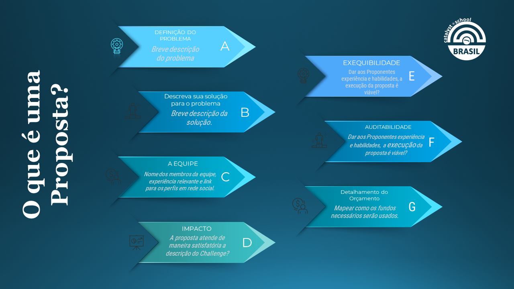
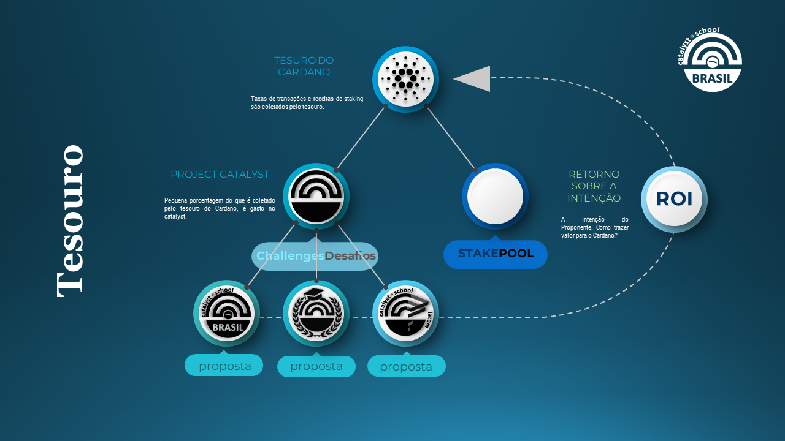

# Introdução ao Catalyst



### Bem-vind@s ao experimento!

#### O que é o Projeto Catalyst?&#x20;

O Catalyst é o maior fundo descentralizado para inovações do mundo. Esse projeto é um experimento que aborda diferentes tópicos e ideias sobre governança e financia projetos independentes que beneficiam o Blockchain Cardano.

Uma vez que o Catalyst é fundamentalmente diferente daquilo que conhecemos das instituições da economia tradicional, também é amplamente referido simplesmente como um experimento.

Enquanto as propostas do Catalyst precisam beneficiar o ecossistema do Cardano, os Challenge Settings (configurações dos desafios) são subconjuntos com um escopo mais refinado. Alguns Challenge Settings podem ser mais centrados na comunidade, como os Community Events Challenge \[insert link], outros especificam tecnicalidades como o Dapps and Integration Challenge \[insert link]. Esses Desafios também passam pelo processo de financiamento do Catalyst a cada rodada para sua implementação no próximo fundo. Cada rodada de financiamento dura 4 meses e os contribuidores com funções oficiais são pagos pelo tesouro Catalyst.

.PNG>) .PNG>)

**Fases**

Cada rodada de financiamento segue as seguintes fases (geralmente em um período de 1 a 2 semanas cada):

* **Compartilhamento de **_**insights**_: A fase de compartilhamento de insights consiste em uma etapa em que a Comunidade do Catalyst compartilha ideias sobre problemas que precisam ser resolvidos, possíveis formas de melhorar os ecossistemas do Cardano e/ou do Catalyst, e qualquer outra coisa que a Comunidade pretenda discutir.
* **Submissão da Proposta**: Durante esta etapa, qualquer membro da comunidade pode apresentar propostas. As propostas podem ser editadas a qualquer momento até o final da fase 'Finalização de Propostas'. Assim, se a ideia/projeto/proposta ainda não estiver concluída, por exemplo, o proponente pode submeter um rascunho/minuta de sua proposta e editá-la posteriormente.
* **Refinamento de proposta**: Todos os membros da comunidade são encorajados a conhecer as propostas e conversar com os proponentes sobre sua percepção de cada ideia, sugerir maneiras de melhorar, mencionar projetos semelhantes para incentivar a cooperação e ajudar os proponentes da maneira que acharem conveniente.
* **Finalização da Proposta**: Esta é a última chance para os proponentes fazerem modificações em suas propostas antes da fase de ‘Avaliação da Proposta’. Durante esta semana, a seção de comentários das propostas no IdeaScale está fechada, para que os proponentes tenham tempo de consolidar as sugestões feitas pela comunidade, rever o checklist dos proponentes e finalizar suas propostas.
* **Avaliações de Propostas** - A fase de "avaliação de propostas" é o momento em que os Conselheiros da Comunidade (CAs) avaliam as propostas com base em um conjunto de critérios e, em seguida, os proposers podem sinalizar essas avaliações se acreditarem que alguma delas não estão de acordo com as diretrizes.
* **Controle de Qualidade da Avaliação** - Esta etapa foi definida para que os vCAs (Conselheiros Veteranos da Comunidade) classifiquem as avaliações, reveja as sinalizações feitas pelos proposers e remover avaliações inválidas.

.PNG>)

#### Funções

O Catalyst tem múltiplas funções que são pagas pelo Project Catalyst:

* _**Proposer**_ - propõe projetos ou desafios para receber financiamento.
* **Proposal Assessor (PA)** - Avalia propostas e recebe recompensas dependendo da qualidade de sua avaliação.
* **Veteran Proposal Assessor (vPA)** - Verifica a qualidade das avaliações.
* _**Referrer**_ - indica um proponente bem sucedido.
* _**Voter**_ - detentor de $ADA que vota em propostas após a avaliação**.**
* **Membros do **_**Circle**_ - um grupo de membros da comunidade que servem como uma matriz para identificar problemas e documentá-los para iOG.
* _**Circle members admins**_ – grupo que dá suporte aos Circle members com a administração e secretariado.
* _**Challenge Teams**_** (Equipes de Desafio) -** Orientar e Administrar Desafios durante toda a rodada de Financiamento

.PNG>)

.PNG>)

**A fase de governança**: é o período de votação, na qual todos os detentores elegíveis da ADA ou Operadores de Stakepool (SPOs) podem se inscrever para votar nas propostas do Catalyst que preferirem e, assim, decidir quem receberá os fundos.

