# Propondo no Catalyst






[orientacoes-para-elaboracao-de-propostas-e-challenges-desafios.md](../orientacoes-para-elaboracao-de-propostas-e-challenges-desafios.md)


.PNG>) 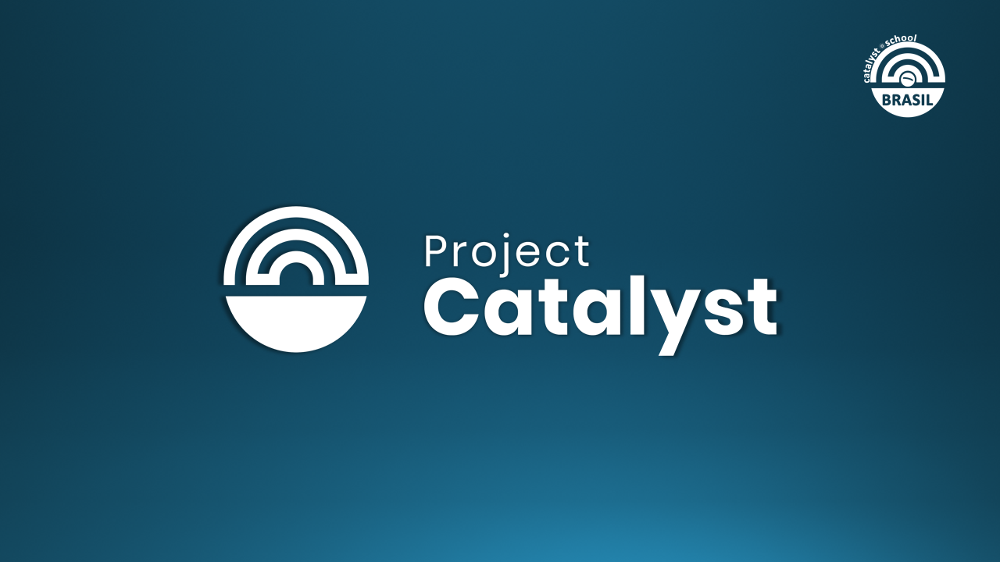  .PNG>) 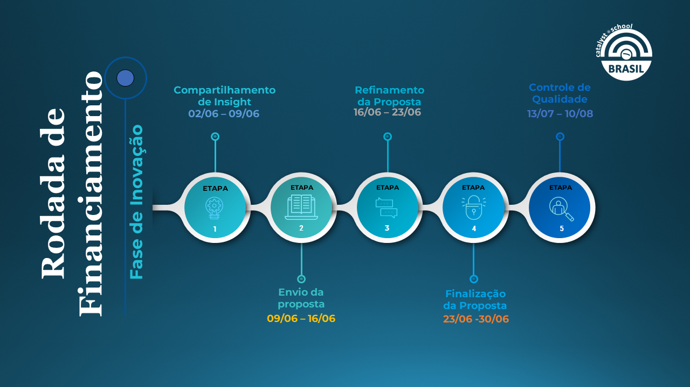 .PNG>) .PNG>) .PNG>) 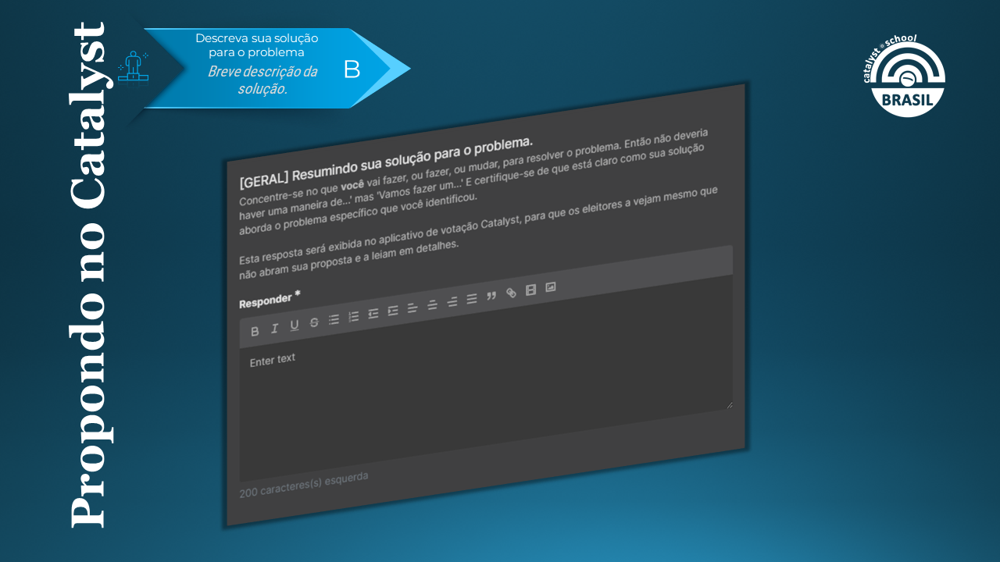 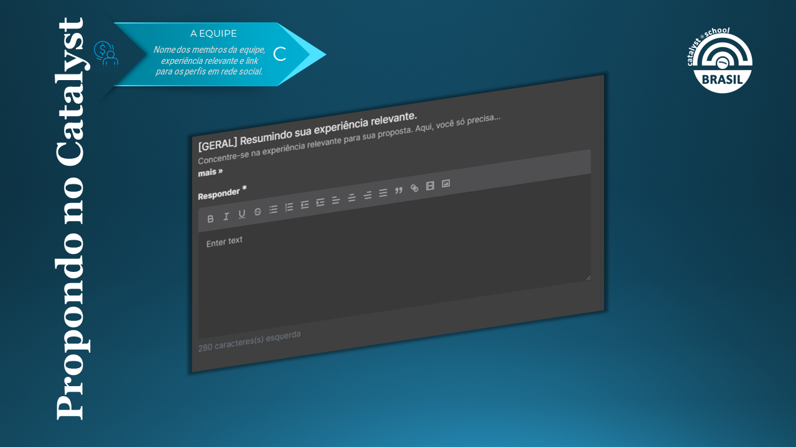 .PNG>) 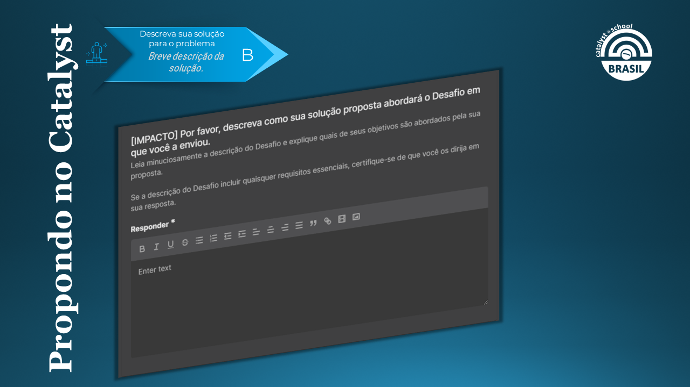 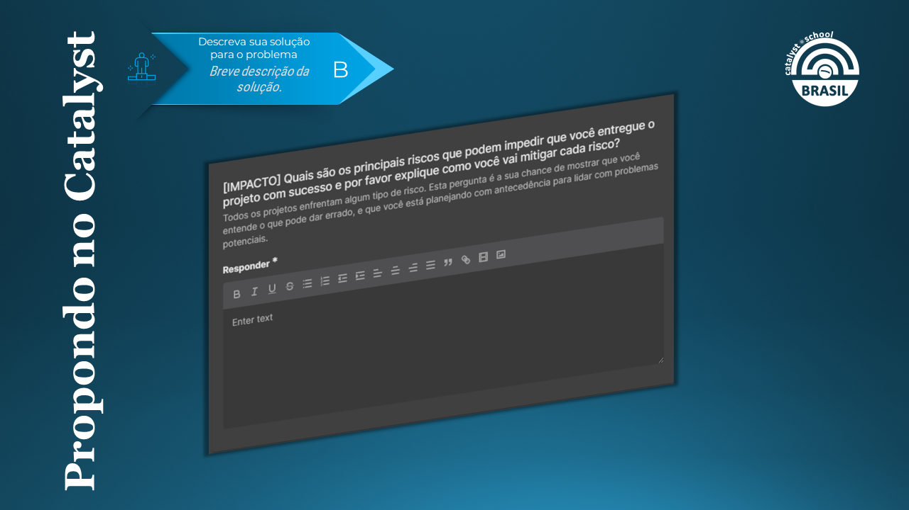 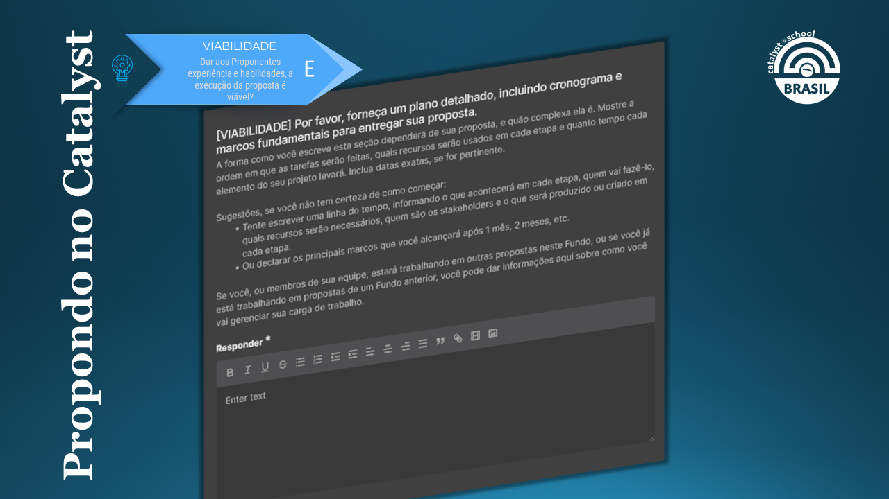 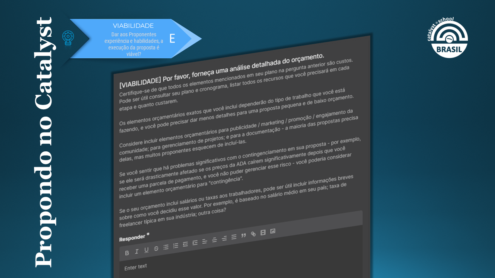 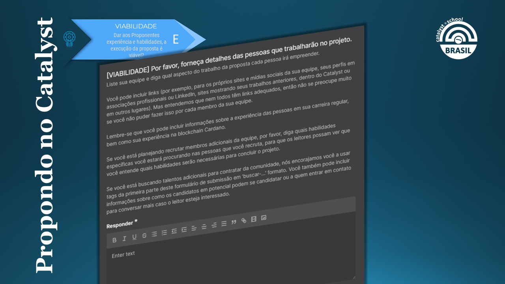 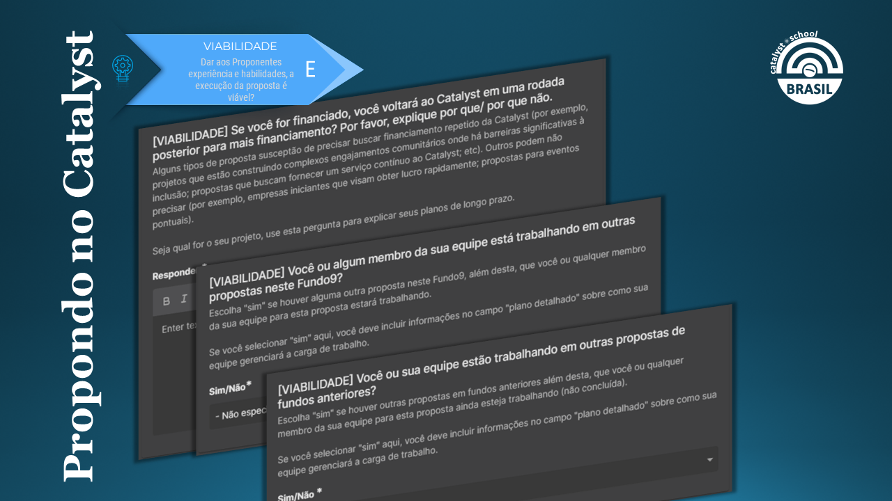 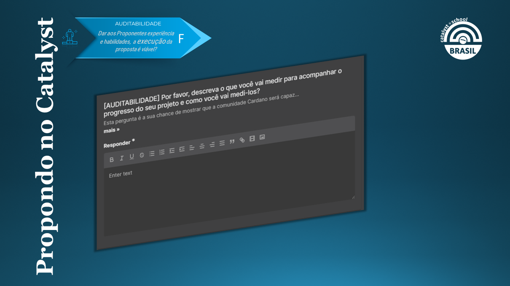 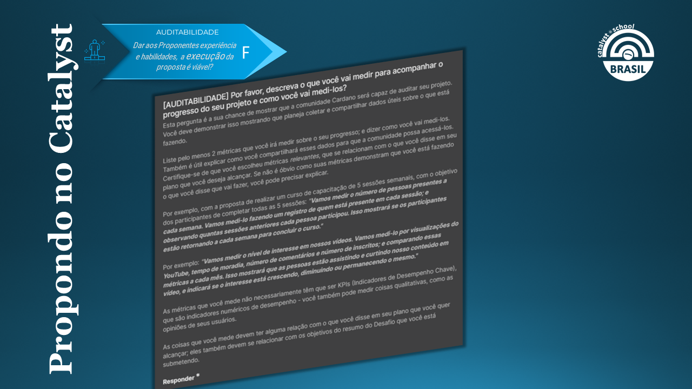 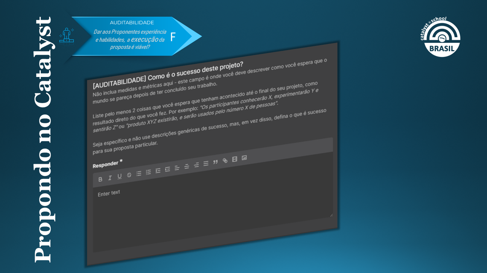 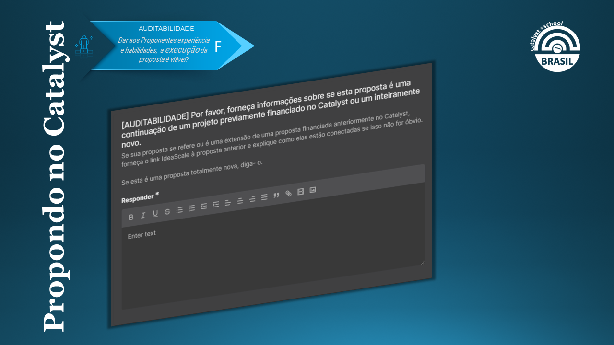 
