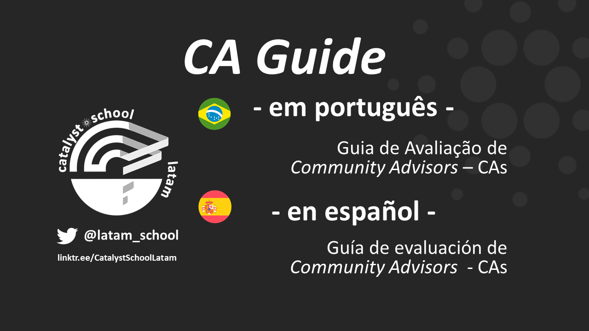
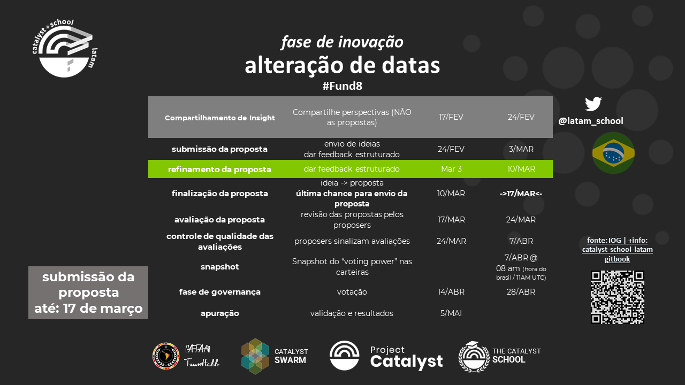
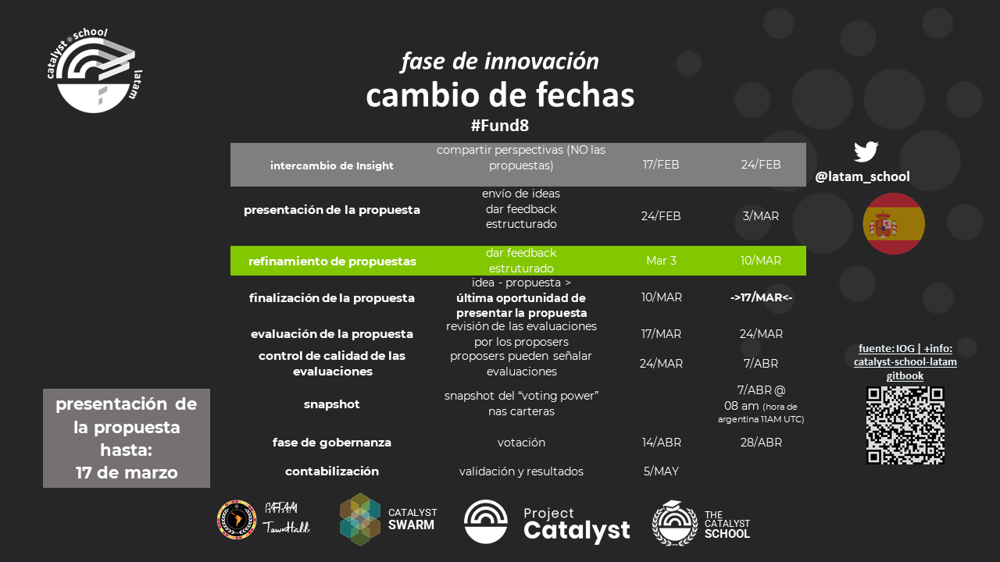

# 🎓 catalyst school brasil

## Recentes


[Fase de governança/gobernanza (promo) - #Fund8](https://www.youtube.com/watch?v=4pie1A3ej98)


#### A catalyst school latam veio replicar o modelo de sucesso já estabelecido pela The Catalyst School: um lugar que foi criado para aumentar o impacto do Catalyst, buscando melhorar a forma como os diferentes participantes interagem.

La catalyst school latam vino a replicar lo modelo de éxito ya establecido por The Catalyst School: un lugar que fue creado para aumentar el impacto del Catalyst, buscando mejorar la forma en que los diferentes participantes interactúan.

#### Telegram: [https://t.me/CatalystSchoolLATAM](https://t.me/CatalystSchoolLATAM)

[Link Tree](https://linktr.ee/CatalystSchoolLatamhttps:/linktr.ee/CatalystSchoolLatam)

#### [Podcast](https://catalystschoollatam.podbean.com/)

#### [Youtube](./#undefined)

#### [Twitter](https://twitter.com/latam\_school)

## Nossa Proposta do #Fund7 no [IdeaScale](https://cardano.ideascale.com/a/dtd/The-Catalyst-School-LATAM/383090-48088)

## Nuestra Propuesta de #Fund7 en el [IdeaScale](https://cardano.ideascale.com/a/dtd/The-Catalyst-School-LATAM/383090-48088)
