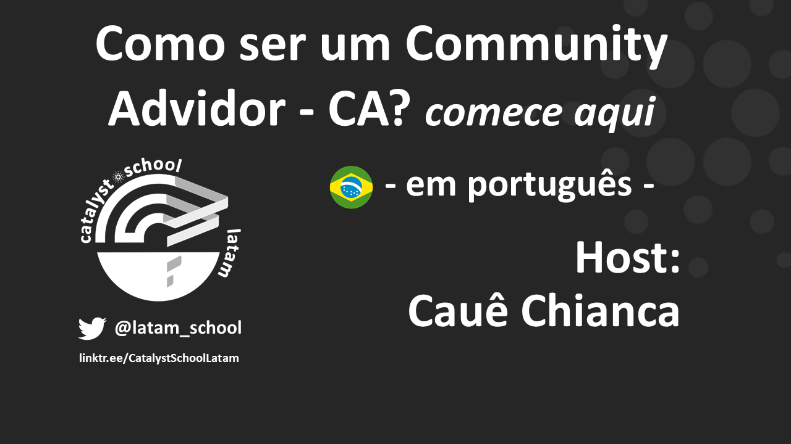

# Como ser um Community Advisor (CA) ?

_content translated from the-catalyst-school \[link here]_


[Youtube: **Como Ser um Community Advisors - Comece aqui!**](https://youtu.be/Jbx63OFUmdI)



[Podcast: **Como Ser um Community Advisors - Comece aqui!**](https://catalystschoollatam.podbean.com/e/em-portugues-como-ser-um-community-advisor-comece-aqui/)



[Sway: Como ser um Community Advisor? comece aqui](https://sway.office.com/2JTLsMJSxMge6B54?ref=Link)


## **Catalyst Community Advisor - Comece aqui!**

Um dos melhores pontos de entrada para novos membros da comunidade no Projeto Catalyst e também no cardano como um todo é ser um **Community Advisor** (Conselheiro da Comunidade - CA). Qualquer um pode aprender, ajudar a comunidade e ganhar ADA ao mesmo tempo.

#### **Ok, então o que é um Community Advisor?**

Um **Community Advisor** é uma função oficial do Catalyst, que tem duas responsabilidades principais:

●      Avaliar as propostas do Catalyst e dar-lhes uma pontuação, com base em certos critérios, lhes dando suporte até a fase de governança.

●      Fornecer feedback valioso aos Proposers do Catalyst para melhorar seus projetos e ideias ao longo do tempo.

#### **Mas, na prática, o que os Community Advisors fazem?**

Os **Community Advisors** são responsáveis pela produção de avaliações para cada proposta apresentada no Catalyst.

Uma avaliação tem que analisar 3 aspectos da proposta:

●      **Impacto / Alinhamento** com os Challenges **(desafios)**: A proposta aborda efetivamente o desafio? E qual é o seu impacto no ecossistema do Cardano?

●      **Viabilidade**: Qual a probabilidade de essa proposta ser implementada com sucesso?

●      **Auditoria**: As informações fornecidas são suficientes para auditar o progresso e o sucesso da proposta?

As avaliações de cada aspecto devem incluir:

●      Um placar de 1 a 5.

●      Uma fundamentação para justificar a pontuação dada.

#### **Como aprender a ser um Community Advisor?**

Existem alguns recursos disponíveis para você aprender a ser um CA:

●      [Diretrizes Oficiais da CA](../guia-de-avaliacao-de-community-advisors-cas-conselheiros-da-comunidade/)

#### Recursos de catalyst _s_chool latam:

○      Sitio

○      [Canal de YouTube](https://www.youtube.com/channel/UCniR1ASrQjPWnrAzePitcwQ)

○      [Podcast](https://catalystschoollatam.podbean.com/)

#### **Há alguma recompensa por trabalhar como Community Advisor?**

Sim. Para cada _Fund_ (rodada de financiamento) do Catalyst, 4% do orçamento total do _Fund_ é destinado ao pagamento pelo trabalho da CA. O pagamento é feito em ADA, mas calculado em USD no dia do pagamento.

#### **Quais são os requisitos para ser um Community Advisor?**

Atualmente, não há requisitos.  Você nem precisa ter ADAs antes de se inscrever. Mas seu trabalho será avaliado e uma qualidade mínima é necessária para que você receba quaisquer recompensas.

#### **E quem avalia a qualidade de trabalho da CA?**

Isso é feito pelos Veteran Community Advisors – vCAs (Conselheiros Veteranos da Comunidade), que são Community Advisors experientes que já participaram do processo anteriormente.

#### **Alguém poderia ser um Community Advisor se ele apresenta uma ideia no catalyst como Proposer?**

Sim, mas há algumas restrições. Um proposer pode ser um CA (community advisor – conselheiro da comunidade) desde que não avalie propostas no Challenge (desafio), onde ele próprio submeteu propostas durante o _Fund_. Mas como existem vários

Desafios em cada _Fund_, você pode atuar como proposer em alguns deles, e como CA em outros.

#### **E onde encontrar outros CAs e fazer perguntas?**

Confira os seguintes canais:

●      [Telegram de CAs](https://t.me/CatalystCommunityAdvisors)

●      [Canal de Discord de CAs](https://discord.gg/SQeHZADzr8) no discord do Catalyst (english)

## [Guia de _Avaliação de Community Advisors_ - CAs](../guia-de-avaliacao-de-community-advisors-cas-conselheiros-da-comunidade/)
